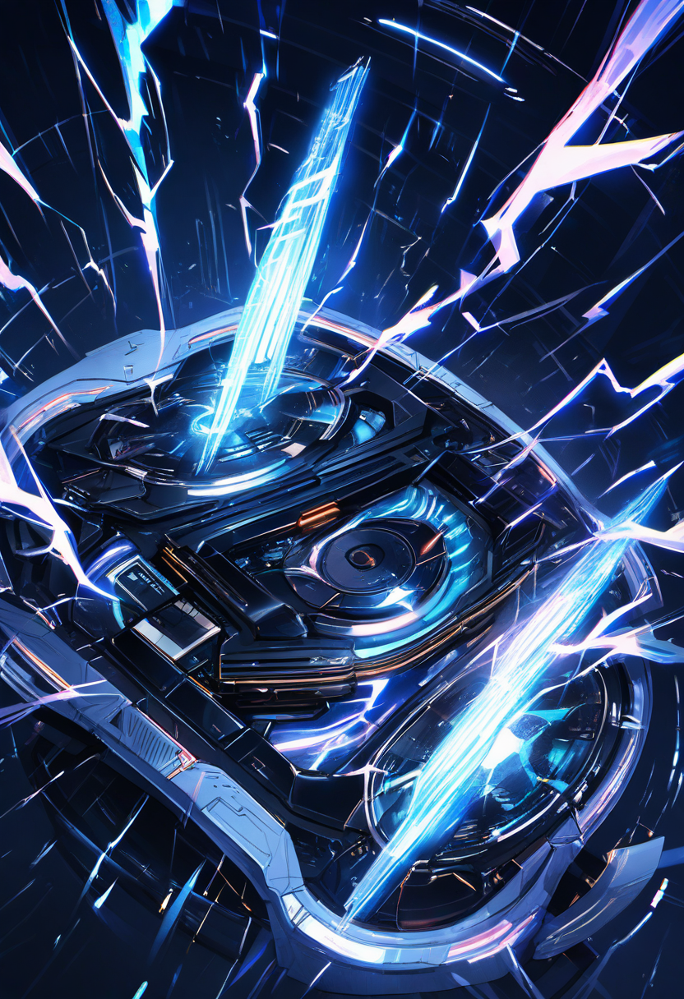

# Results-P8: RTX PRO 6000 Blackwell (98GB VRAM) Benchmark Artifacts

**Machine**: AMD Ryzen Threadripper PRO 7975WX / NVIDIA RTX PRO 6000 Blackwell Max-Q (98GB VRAM) / DDR5 192GB
**Date**: 2026-03-10 ~ 03-11 (R1/R2)
**ComfyUI**: v0.16.4 / PyTorch 2.10.0+cu128
**Ollama**: 0.17.7

## Storage Tested

| Drive | Device | Interface | Catalog Speed |
|-------|--------|-----------|---------------|
| D: | Samsung 9100 PRO 8TB | PCIe Gen5 NVMe | ~14,800 MB/s |
| E: | Samsung 870 QVO 8TB | SATA SSD | ~560 MB/s |
| F: | HDD 8TB | SATA HDD | ~180 MB/s |
| G: | Samsung 9100 PRO 8TB (ICY DOCK) | PCIe Gen5 NVMe (removable) | ~14,800 MB/s |

---

## Directory Structure (classified by total model size)

```
Results-P8/
├── small-models-7GB/          # ~7GB models: fast load, storage diff minimal
│   ├── sdxl/                  # Animagine XL 4.0 (6.46GB checkpoint)
│   │   └── {D,E,F,G}_sdxl_*.png    # 832x1216, euler 28steps, CFG=5
│   └── aicuty-sdxl/           # + 2 LoRA (490MB) + RealESRGAN Upscaler (18MB)
│       └── {D,E,F,G}_aicuty_*.png  # 736x1128 → 4x Upscale = 2944x4512
├── medium-models-15GB/        # ~15GB models: cold start shows storage diff
│   └── ltx-video-2b/          # LTX-Video 2B (5.9GB) + T5-XXL FP16 (9.1GB)
│       └── {D,E,F,G}_ltx_video_*.webp  # 512x320, 25 frames @24fps, animated WEBP
└── workflows/                 # ComfyUI workflow JSON files
    ├── sdxl.json              # Basic SDXL benchmark
    ├── aicuty_sdxl.json       # AiCuty pipeline (Checkpoint + 2LoRA + Upscaler)
    └── ltx_2b_t2v_bench.json  # LTX-Video 2B text-to-video
```

## ComfyUI Startup Parameters

All benchmarks used: `python main.py --listen 0.0.0.0 --port 8188` (default VRAM mode)

| Parameter | Behavior | When to Use |
|-----------|----------|-------------|
| (default) | Auto offload when VRAM full | General use |
| `--highvram` | Keep all models in VRAM | 96GB+ VRAM (this machine) |
| `--lowvram` | Aggressive VRAM release | 6-16GB VRAM, storage speed critical |

With 98GB VRAM, all tested models fit entirely in VRAM. Storage speed differences only appear on **cold start** (first load from disk).

## Key Findings

### Small Models (~7GB) — Storage Diff: Negligible
- **SDXL cold start**: D: 6.1s / E: 7.1s / F: 7.2s / G: 6.1s
- **AiCuty cold start**: D: 13.2s / E: 13.2s / F: 12.4s / G: 13.2s
- **Warm start**: 0.03-0.04s (all drives identical, GPU-bound)
- 7GB fits comfortably in 98GB VRAM; after first load, storage is irrelevant

### Medium Models (~15GB) — Storage Diff: Significant on Cold Start
- **LTX-Video Run 1 (cold)**: D: 8.1s / E: 37.4s / F: 60.9s / G: 11.4s
- **Run 2-3 (VRAM cached)**: ~7.3s all drives
- **D: vs F: = 7.5x difference** on cold start with ~15GB total model load
- Gen5 NVMe advantage becomes clear when loading 10GB+ of model data

### R1 vs R2: VRAM Zombie Process Issue
R1 showed massive storage-dependent performance differences in Ollama benchmarks (186 vs 19-21 tok/s). R2 with clean VRAM showed **all drives performing identically** (~189 tok/s for qwen3:8b). The R1 differences were caused by **zombie Ollama processes occupying 97GB of 98GB VRAM**, not storage speed.

## Samples

### AiCuty SDXL (Animagine XL 4.0 + Niji Anime LoRA + Enchanting Eyes LoRA + RealESRGAN 4x)
| D: Gen5 NVMe (15.2s cold) | E: SATA SSD (17.3s cold) | F: HDD (17.3s cold) | G: ICY DOCK (17.3s cold) |
|---|---|---|---|
|  |  |  |  |

### SDXL Basic (Animagine XL 4.0, 28 steps)
| D: Gen5 NVMe | E: SATA SSD | F: HDD | G: ICY DOCK |
|---|---|---|---|
|  |  |  |  |

### LTX-Video 2B (512x320, 25 frames, animated WEBP)
| D: Gen5 NVMe (8.1s cold) | E: SATA SSD (37.4s cold) | F: HDD (60.9s cold) | G: ICY DOCK (11.4s cold) |
|---|---|---|---|
|  |  |  |  |

> Cold start times show D: (Gen5) loading ~15GB of models 7.5x faster than F: (HDD).
> After models are cached in VRAM, all drives produce identical output at identical speed.
